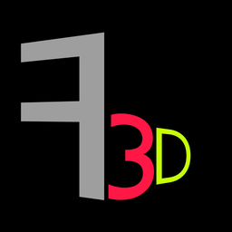

#  Forge3D

> [!IMPORTANT]
> **Forge3D is currently under active development.** Interfaces, features, and core architecture are evolving rapidly.
> 
>  **Note on this repository:** This page is **not a source code repository**. It serves as an official distribution hub for executable releases, issue reporting, release notes, and project links.

---

  <a href="https://forge3d.blinch4k.workers.dev/"> Official Website</a> •
  <a href="https://github.com/kitworks-official/forge3d/releases"> Download Releases</a> •
  <a href="https://t.me/official_xero"> Telegram Channel</a>

---

## 🚀 Overview

**Forge3D** is a lightweight, high-performance 3D game engine and editor designed around a visual **Event Sheet** paradigm (popularized by Construct). It lets creators, indie developers, and designers build full-featured 3D games without writing traditional code or tangling complex node graphs.

By combining intuitive event-driven logic with a native Rust physics core and AI-assisted automation, Forge3D streamlines 3D game development from prototype to final build.

---

## Highlights & Features

-  **Event Sheet System** — Define game logic using clear Conditions and Actions. Object filtering and scope handling work automatically behind the scenes.
-  **Modular Behaviors** — Attach ready-to-use movement and mechanics straight from the Inspector:
  - *Platformer 3D, FPS Controller, Top-Down Navigation, Health & Damage, Tweens, Patrol Routes, Spawner, and more.*
-  **AI Agent & MCP Integration** — Built-in AI assistant supporting Model Context Protocol (MCP) capable of building scenes, placing assets, and wiring logic based on natural language prompts.
-  **3D Physics (Rapier 3D)** — Powered by a fast, deterministic Rust physics engine featuring Rigidbodies, Collision Layers, Raycasting, and Trigger Volumes.
-  **Asset Pipeline & Materials** — Seamlessly import standard 3D formats (`.gltf`, `.glb`, `.fbx`, `.obj`) with PBR material editing and viewport gizmos.
-  **Developer Experience** — Live debugging tools, inspectable variables, Event Sheet breakpoints, and multi-level Undo/Redo.
-  **One-Click Export** — Build standalone Windows executables (`.exe`) or export directly to WebGL (`HTML5`) for instant browser playback.

---

##  Getting Started

1. Head over to the **[Releases Page](https://github.com/kitworks-official/forge3d/releases)**.
2. Download the latest `Forge3D.exe` executable package.
3. Launch the application — no complex installation or heavy dependencies required.
4. Open the sample scene or start a new project from scratch!

---

##  Community & Feedback

Since Forge3D is in active development, your feedback, bug reports, and feature requests are essential!

* **Bug Reports & Ideas:** Feel free to open an issue here in the [GitHub Issues](https://github.com/kitworks-official/forge3d/issues) tab.
* **Community & News:** Join our **[Telegram Channel](https://t.me/official_xero)** for roadmap announcements, progress updates, and discussions.
